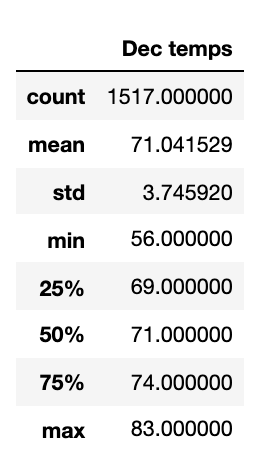

# Surfs_Up Analysis

## Overview of statistical analysis
W. Avy wants more information about temperature trends in Oahu before he opens his surf shop. He has asked us to perform a statistical analysis on the temperatures of Oahu for the months of June and December to determine if the surf and ice cream shop is sustainable year-round. 

## Results
Below are the summary statistics we found for both June and December.

-The first major difference we can see from these 

## Summary 
