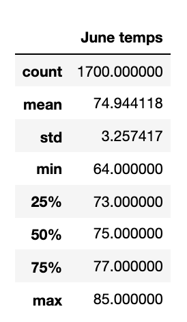

# Surfs_Up Analysis

## Overview of statistical analysis
W. Avy wants more information about temperature trends in Oahu before he opens his surf shop. He has asked us to perform a statistical analysis on the temperatures of Oahu for the months of June and December to determine if the surf and ice cream shop is sustainable year-round. 

## Results
Below are the summary statistics we found for both June and December.

-The first difference we can see from these charts is that there is an approximate 4 degree difference in the average (mean) temperature for June and December. June's average temperature is approximately 75 degrees and December's average temperature is 71 degrees. 

-The second difference we can see is that there is an 8 degree difference in the minimum temperature between June and December. The lowest temperature recorded in June is 64 degrees and in December it is 56 degrees.

-The third difference we can see from this analysis, is the difference of the maximum temperatures. In June, the max temperature is 85 degrees and in December, the max temperature is 83 degrees.

## Summary 
In summary, we can see that in general, the climate in Oahu is fairly stable between the two different seasons, summer and winter. The average temperature of both months is only 4 degrees different, and both are in the 70's. That is a warm average temperature which lends to surfing and ice cream being desirable. From the max temperature statistic, we can also see that the maximum temperature is not very different in either month as well. The temperatures definitely drop lower in Decemeber, but there is a still a good chance you will have some really nice days in that month as well. From this analysis, I would advise W. Avy that the shop would be sustainable year round.
However, just looking at one month in the summer and one month in the winter does not give a very accurate picture. My suggestion would be to run another query that filters by seasons. I would group summer months together (say June, July, August) and then group winter months together (December,January,February). This may give a more accurate look into how the two opposing seasons compare. 
Or if you just wanted to look at these months still, another query that could be done to give more insight into the weather during these months is a query into the precipitation or wind speed levels. Rainy days/gloomy days or extremely windy days would probably deter people from going out to surf or going out to shop and eat ice cream. Even though the temperatures might be warm, these other factors would play an effect. December might stay mild, but there might be a lot of rain. 
